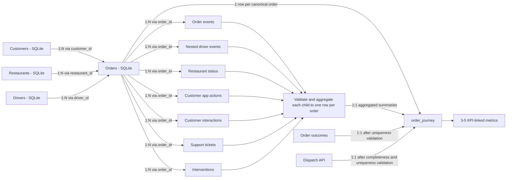

# FlashEats - Architecture and Pipeline Decisions

## 1. Business goal and scope

- **Track:** A - FlashEats.
- **Business KPI:** Reduce Late Delivery Rate (LDR).
- **Primary business question:** Where in the order lifecycle do delays accumulate, and which interventions are associated with better outcomes?
- **Analytical grain:** The published `order_journey` model will contain exactly one row per `order_id` after agreed deduplication rules are applied.

The local driver telemetry contains `assigned`, `gps_ping`, `picked_up`, and `delivered` events, but no `driver_arrived_at_restaurant` event. This prevents a clean observed split between time spent waiting for the driver to reach the restaurant and subsequent restaurant/pickup activity. It does **not** prevent calculation of end-to-end delivery delay or analysis of other observed milestones. Any phase-level interpretation that depends on the missing arrival event must remain unknown rather than be estimated silently.

## 2. Business questions and information needs

| Business question | Information needed | Sources |
|---|---|---|
| What is the Late Delivery Rate? | Promised ETA, actual delivery time, final status, delivered/cancelled/refunded treatment, and the agreed lateness threshold | `flasheats.db` `orders`; `order_outcomes.csv`; `client_metric_definitions.json` |
| Where in the lifecycle does delay accumulate? | Order creation, assignment, pickup, delivery, restaurant status, and other lifecycle timestamps | `flasheats.db` `orders`; `order_events.csv`; `restaurant_status.csv`; `driver_events.json`; Dispatch API |
| Which interventions are associated with better outcomes? | Intervention type/time, order outcome, delay, and lifecycle context | `order_interventions.csv`; `order_outcomes.csv`; `flasheats.db` `orders` |
| Are there early signals of customer distress? | ETA views/app actions, customer contacts, support tickets, and eventual outcome | `customer_app_actions.csv`; `customer_interactions.csv`; `support_tickets.csv`; `order_outcomes.csv` |
| Which operational conditions correlate with late delivery? | Traffic, weather, distance, restaurant/driver attributes, restaurant status, and outcome | `flasheats.db`; `restaurant_status.csv`; `order_outcomes.csv` |
| Was dispatch retrieval complete and did reassignment occur? | API record total, pagination metadata, assigned/original driver, reassignment time, ETA, and dispatch status | Dispatch API (`GET /dispatch/orders`) |

## 3. Complete source map and data grains

`data/raw/` contains 12 preserved source files: one SQLite database, eight CSV files, and three JSON files. The SQLite database is expanded by table below. The Dispatch API is a thirteenth logical source available separately through the local reference service; it is not the same source as `driver_events.json`.

No organizational data owner is identified in the supplied materials. Entries below therefore distinguish the observable source system or planned system of record from the **unverified organizational owner**.

| Physical source | Source system / ownership status | Raw grain | Normalized grain | Keys | Information supplied and known gaps |
|---|---|---|---|---|---|
| `data/raw/flasheats.db` - `orders` | Planned order system of record: SQLite operational database. Organizational owner unverified. | One persisted order row; 1,603 rows contain 1,600 distinct `order_id` values. | One canonical row per order after an explicit deduplication rule. | `order_id`; references `customer_id`, `restaurant_id`, `driver_id`. | Core timestamps, status, city, distance, traffic, and weather. Duplicate order IDs require validation; the missing arrival milestone is not present here. |
| `data/raw/flasheats.db` - `customers` | Planned customer dimension source: SQLite operational database. Organizational owner unverified. | One row per customer. | One row per customer. | `customer_id`. | Customer identity and location fields. Ownership, freshness, and permitted use are unverified. |
| `data/raw/flasheats.db` - `drivers` | Planned driver dimension source: SQLite operational database. Organizational owner unverified. | One row per driver. | One row per driver. | `driver_id`. | Rating, vehicle type, and experience. Ownership and freshness are unverified. |
| `data/raw/flasheats.db` - `restaurants` | Planned restaurant dimension source: SQLite operational database. Organizational owner unverified. | One row per restaurant. | One row per restaurant. | `restaurant_id`. | Restaurant name, cuisine, location, and manual-update flag. |
| `data/raw/restaurants.csv` | Duplicate flat-file representation; not the planned system of record. Organizational owner unverified. | One row per restaurant. | Reference/validation only unless a source decision changes. | `restaurant_id`. | Its 60 rows matched the SQLite `restaurants` table during Phase 1.1 inspection, but its replication lineage and freshness contract are unverified. |
| `data/raw/support_tickets.csv` | Support export. Organizational owner unverified. | One row per ticket. | One order-level ticket summary before joining. | `ticket_id`, `order_id`. | Ticket time, category, and message. There are 202 rows but 201 distinct ticket IDs, so duplicates must be validated rather than silently discarded. |
| `data/raw/restaurant_status.csv` | Restaurant-status export. Organizational owner unverified. | One row per status observation/update. | Latest/agreed status and status counts per order. | `order_id`, `restaurant_id`; no standalone status ID. | Restaurant status and last-update time. Multiple rows can exist per order and ordering depends on `last_updated_at`. |
| `data/raw/customer_interactions.csv` | Customer-service interaction export. Organizational owner unverified. | One row per interaction. | Interaction counts/timestamps/types per order. | `interaction_id`, `order_id`. | Contact channel, type, time, and detail. There are 497 rows but 494 distinct interaction IDs. |
| `data/raw/customer_app_actions.csv` | Customer-app event export. Organizational owner unverified. | One row per app action. | Action counts and first/last relevant timestamps per order. | `action_id`, `order_id`, `customer_id`. | Behavioral signals such as repeated ETA viewing; coverage is not universal across orders. |
| `data/raw/order_events.csv` | Order-event export. Organizational owner unverified. | One row per order event. | Agreed lifecycle milestone summary per order. | `event_id`, `order_id`; actor fields provide context. | Timestamped workflow events with actor and source system. Event semantics and lifecycle ordering require validation. |
| `data/raw/driver_events.json` | Local driver-telemetry file. Organizational owner unverified. | One JSON object per driver containing a nested `events` list. | First flatten to one row per event, then aggregate observed milestones/signals per order. | Parent `driver_id`; nested `order_id`, event `type`, and `timestamp`. | 120 driver documents and 10,035 nested events. No `driver_arrived_at_restaurant` event is present. This is **not** the Dispatch API response. |
| `data/raw/order_interventions.csv` | Operations-intervention export. Organizational owner unverified. | One row per intervention. | Intervention counts, types, and timing per order. | `intervention_id`, `order_id`. | Operational rescue actions and reasons. Association with outcomes must not be presented as causal without further evidence. |
| `data/raw/order_outcomes.csv` | Provided outcome dataset. Organizational owner and derivation lineage unverified. | One row per order. | One row per order. | `order_id`. | Normalized status, delivered/late flags, delay minutes, and outcome bucket. Phase 2 must verify derivation against observed order fields before treating these labels as authoritative. |
| `data/raw/client_metric_definitions.json` | Stakeholder-definition document; no canonical KPI owner is documented. | One document containing stakeholder definitions. | Governance input; not joined as an event table. | Logical key: `metric_under_review`. | Records competing LDR interpretations. It does not record final approval. |
| `data/raw/class7_model_brief.json` | Classroom/project brief; not an operational system of record. Owner unverified. | One project brief document. | Governance input; not joined as an event table. | No operational primary key. | States the KPI, business question, and Class 7 inputs. |
| Local Dispatch API at `http://127.0.0.1:8000` | Reference mock of a dispatch service. Production/organizational owner unverified. | One dispatch record per order, returned in paginated response envelopes. | One row per `order_id`. | `order_id`; driver fields link to `driver_id`. | Assignment/reassignment timestamps, pickup estimate, current ETA, status, and model version. The submission-owned fixture has 1,600 unique order records and is copied byte-for-byte from the classroom fixture with provenance recorded in `mock_api/PROVENANCE.md`. Raw response pages are preserved by the extraction layer. |

## 4. Late Delivery Rate contract

`client_metric_definitions.json` records a leadership claim of approximately 56%, but a claim is not a complete metric contract. No supplied artifact identifies a formally approved canonical owner or definition.

| View | Numerator | Denominator | Threshold | Cancellation/refund treatment | Ownership/approval status |
|---|---|---|---|---|---|
| VP Operations | Delivered orders after promised ETA. | Not specified. | Any delay greater than 0 minutes. | Not specified. | Definition attributed to VP Operations; formal approval unverified. |
| Support Lead | Orders considered meaningfully late. | Not specified. | More than 10 minutes beyond ETA. | Not specified. | Definition attributed to Support Lead; formal approval unverified. |
| Finance | Not specified. | Operational population excluding cancelled/refunded orders. | Not specified. | Explicitly excludes cancelled/refunded orders. | Definition attributed to Finance; formal approval unverified. |
| Data Team historical dashboard | Not fully specified. | Delivered orders with non-null actual delivery time. | Not specified in the definition file. | Cancelled orders are implicitly outside a delivered-only denominator; refund handling is not specified. | Historical implementation attributed to Data Team; canonical approval unverified. |

### Unapproved working definition for Phase 2 validation

Until a KPI owner approves a contract, Phase 2 may calculate a clearly labelled **candidate operational LDR** for comparison only:

- **Numerator:** delivered orders with non-null `promised_eta` and `actual_delivery_at` where actual delivery is later than promised ETA.
- **Denominator:** delivered orders with both timestamps present.
- **Threshold:** greater than 0 minutes late.
- **Cancellation treatment:** excluded by the delivered-only denominator.
- **Refund treatment:** unresolved because the supplied order schema does not establish an approved refund rule.
- **Owner:** unresolved; this is an engineering assumption combining the VP Operations threshold with the Data Team denominator, not stakeholder approval.

The pipeline must keep the >10-minute support view and any finance-approved population as separately named variants rather than silently replacing the candidate definition.

## 5. Workflow data model

Directly joining one-to-many child records to orders would duplicate orders and corrupt operational and financial metrics. Every 1:N source must therefore be validated, normalized, and aggregated to `order_id` before its left join to the order-grain model. One-to-one sources must also pass uniqueness checks before joining.

Left joins preserve the complete canonical order population. Missing child activity remains an observed absence and is represented according to an explicit field-level rule; it must not cause an order to disappear.

## 6. Pipeline stages and idempotency

The approved pipeline sequence remains:

1. **Extract:** Read SQLite and preserved files; retrieve all Dispatch API pages with bounded exponential backoff and completeness checks; preserve raw API responses.
2. **Validate:** Apply structural, lifecycle, cross-source, freshness, uniqueness, and retrieval-completeness gates with PASS/WARN/FAIL results.
3. **Clean:** Normalize types and representations and apply only documented deduplication/null policies. Retain evidence of quality issues rather than silently fixing them.
4. **Transform:** Flatten nested events, aggregate every 1:N child source to order grain, and left-join to produce `order_journey`.
5. **Save:** Publish only after required validations pass. Treat `data/raw/` as the Bronze preservation area and write partitioned Silver model/validation outputs and Gold metrics beneath `data/processed/`.

Idempotent reruns will:

- partition generated raw API responses and processed outputs by logical run date;
- replace the same logical partition rather than append duplicates; and
- write to a temporary sibling path before an atomic `os.replace`, preventing partially published output.

The `logs/` and `data/processed/` directories are retained in Git with placeholders. Runtime writers must still create required dated subdirectories with `parents=True, exist_ok=True`.

## 7. Configuration and package execution

- `DISPATCH_API_URL` is the service base URL. The documented classroom default is `http://127.0.0.1:8000`; Phase 2 will append `/health` or `/dispatch/orders` as appropriate.
- `.env.example` documents shell environment variables; `PipelineConfig.from_env()` reads the process environment and does not load `.env` automatically.
- `src/pipeline/__init__.py` makes the pipeline package explicit. Until Phase 2 adds the single pipeline entry point, import checks should be run from the project root with `PYTHONPATH=src`, for example: `PYTHONPATH=src python3 -c "from pipeline.config import PipelineConfig"`.
- The submission-owned mock service runs with `python3 -m mock_api.server`; extraction no longer depends on the sibling `reference/` directory.

## 8. Decision register and Phase 2 handoff

### Confirmed facts

- Track A, LDR, order grain, aggregate-before-join, the five pipeline stages, and idempotent reruns are approved architecture decisions.
- The raw directory contains 12 tracked files matching the supplied classroom inputs at Phase 1.1 verification time.
- Orders contain duplicate `order_id` records; several child exports also contain duplicate identifiers.
- Local driver telemetry does not contain `driver_arrived_at_restaurant`.
- Dispatch API records and nested driver telemetry are separate sources with different grains.
- The submission-owned standard-library mock service and byte-identical classroom fixture make Dispatch extraction reproducible from a fresh clone.

### Assumptions and unresolved decisions

- Organizational source owners, freshness expectations, and the canonical KPI owner are unverified.
- The candidate LDR definition above is not stakeholder-approved.
- Refund treatment remains unresolved.
- `order_outcomes.csv` derivation lineage and authority must be checked before using its flags as truth.

### Extraction handoff

The Phase 2 extraction layer now loads the local sources without cleaning and retrieves a complete Dispatch snapshot with retries, page/count/uniqueness evidence, raw-page preservation, and partition replacement on rerun. Future authorized stages may consume these outputs, but must not silently resolve the KPI or source-ownership questions recorded above.
