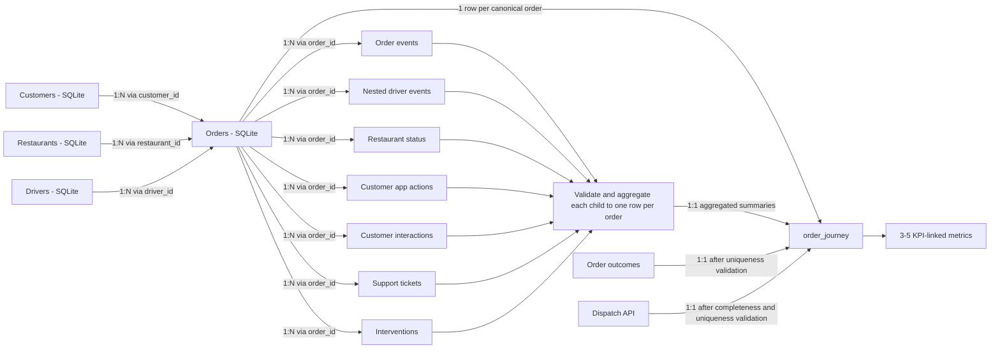

# FlashEats - Architecture and Pipeline Decisions

## 1. Business goal and scope

- **Track:** A - FlashEats.
- **Business KPI:** Reduce Late Delivery Rate (LDR).
- **Primary business question:** Where in the order lifecycle do delays accumulate, and which interventions are associated with better outcomes?
- **Analytical grain:** The published `order_journey` model contains exactly one row per `order_id` after documented deduplication rules are applied.

The local driver telemetry contains `assigned`, `gps_ping`, `picked_up`, and `delivered` events, but no `driver_arrived_at_restaurant` event. This prevents a clean observed split between time spent waiting for the driver to reach the restaurant and subsequent restaurant/pickup activity. It does **not** prevent calculation of end-to-end delivery delay or analysis of other observed milestones. Any phase-level interpretation that depends on the missing arrival event must remain unknown rather than be estimated silently.

## 2. Business questions and information needs

| Business question | Information needed | Sources |
|---|---|---|
| What is the Late Delivery Rate? | Promised ETA, actual delivery time, final status, delivered/cancelled/refunded treatment, and the agreed lateness threshold | `flasheats.db` `orders`; `order_outcomes.csv`; `client_metric_definitions.json` |
| Where in the lifecycle does delay accumulate? | Order creation, assignment, pickup, delivery, restaurant status, and other lifecycle timestamps | `flasheats.db` `orders`; `order_events.csv`; `restaurant_status.csv`; `driver_events.json`; Dispatch API |
| Which interventions are associated with better outcomes? | Intervention type/time, order outcome, delay, and lifecycle context | `order_interventions.csv`; `order_outcomes.csv`; `flasheats.db` `orders` |
| Are there early signals of customer distress? | ETA views/app actions, customer contacts, support tickets, and eventual outcome | `customer_app_actions.csv`; `customer_interactions.csv`; `support_tickets.csv`; `order_outcomes.csv` |
| Which operational conditions correlate with late delivery? | Traffic, weather, distance, restaurant/driver attributes, restaurant status, and outcome | `flasheats.db`; `restaurant_status.csv`; `order_outcomes.csv` |
| Was dispatch retrieval complete and did reassignment occur? | API record total, pagination metadata, assigned/original driver, reassignment time, ETA, and dispatch status | Dispatch API (`GET /dispatch/orders`) |

## 3. Complete source map and data grains

`data/raw/` contains 12 preserved source files: one SQLite database, eight CSV files, and three JSON files. The SQLite database is expanded by table below. The Dispatch API is a thirteenth logical source available separately through the local reference service; it is not the same source as `driver_events.json`.

No organizational data owner is identified in the supplied materials. Entries below therefore distinguish the observable source system or planned system of record from the **unverified organizational owner**.

| Physical source | Source system / ownership status | Raw grain | Normalized grain | Keys | Information supplied and known gaps |
|---|---|---|---|---|---|
| `data/raw/flasheats.db` - `orders` | Planned order system of record: SQLite operational database. Organizational owner unverified. | One persisted order row; 1,603 rows contain 1,600 distinct `order_id` values. | One canonical row per order after an explicit deduplication rule. | `order_id`; references `customer_id`, `restaurant_id`, `driver_id`. | Core timestamps, status, city, distance, traffic, and weather. Duplicate order IDs require validation; the missing arrival milestone is not present here. |
| `data/raw/flasheats.db` - `customers` | Planned customer dimension source: SQLite operational database. Organizational owner unverified. | One row per customer. | One row per customer. | `customer_id`. | Customer identity and location fields. Ownership, freshness, and permitted use are unverified. |
| `data/raw/flasheats.db` - `drivers` | Planned driver dimension source: SQLite operational database. Organizational owner unverified. | One row per driver. | One row per driver. | `driver_id`. | Rating, vehicle type, and experience. Ownership and freshness are unverified. |
| `data/raw/flasheats.db` - `restaurants` | Planned restaurant dimension source: SQLite operational database. Organizational owner unverified. | One row per restaurant. | One row per restaurant. | `restaurant_id`. | Restaurant name, cuisine, location, and manual-update flag. |
| `data/raw/restaurants.csv` | Duplicate flat-file representation; not the planned system of record. Organizational owner unverified. | One row per restaurant. | Reference/validation only unless a source decision changes. | `restaurant_id`. | Its 60 rows matched the SQLite `restaurants` table during Phase 1.1 inspection, but its replication lineage and freshness contract are unverified. |
| `data/raw/support_tickets.csv` | Support export. Organizational owner unverified. | One row per ticket. | One order-level ticket summary before joining. | `ticket_id`, `order_id`. | Ticket time, category, and message. There are 202 rows but 201 distinct ticket IDs, so duplicates must be validated rather than silently discarded. |
| `data/raw/restaurant_status.csv` | Restaurant-status export. Organizational owner unverified. | One row per status observation/update. | Latest/agreed status and status counts per order. | `order_id`, `restaurant_id`; no standalone status ID. | Restaurant status and last-update time. Multiple rows can exist per order and ordering depends on `last_updated_at`. |
| `data/raw/customer_interactions.csv` | Customer-service interaction export. Organizational owner unverified. | One row per interaction. | Interaction counts/timestamps/types per order. | `interaction_id`, `order_id`. | Contact channel, type, time, and detail. There are 497 rows but 494 distinct interaction IDs. |
| `data/raw/customer_app_actions.csv` | Customer-app event export. Organizational owner unverified. | One row per app action. | Action counts and first/last relevant timestamps per order. | `action_id`, `order_id`, `customer_id`. | Behavioral signals such as repeated ETA viewing; coverage is not universal across orders. |
| `data/raw/order_events.csv` | Order-event export. Organizational owner unverified. | One row per order event. | Agreed lifecycle milestone summary per order. | `event_id`, `order_id`; actor fields provide context. | Timestamped workflow events with actor and source system. Event semantics and lifecycle ordering require validation. |
| `data/raw/driver_events.json` | Local driver-telemetry file. Organizational owner unverified. | One JSON object per driver containing a nested `events` list. | First flatten to one row per event, then aggregate observed milestones/signals per order. | Parent `driver_id`; nested `order_id`, event `type`, and `timestamp`. | 120 driver documents and 10,035 nested events. No `driver_arrived_at_restaurant` event is present. This is **not** the Dispatch API response. |
| `data/raw/order_interventions.csv` | Operations-intervention export. Organizational owner unverified. | One row per intervention. | Intervention counts, types, and timing per order. | `intervention_id`, `order_id`. | Operational rescue actions and reasons. Association with outcomes must not be presented as causal without further evidence. |
| `data/raw/order_outcomes.csv` | Provided outcome dataset. Organizational owner and derivation lineage unverified. | One row per order. | One row per order. | `order_id`. | Normalized status, delivered/late flags, delay minutes, and outcome bucket. Measured comparisons found no listed disagreements, but derivation and authority remain unverified; calculated metrics use order fields instead. |
| `data/raw/client_metric_definitions.json` | Stakeholder-definition document; no canonical KPI owner is documented. | One document containing stakeholder definitions. | Governance input; not joined as an event table. | Logical key: `metric_under_review`. | Records competing LDR interpretations. It does not record final approval. |
| `data/raw/class7_model_brief.json` | Classroom/project brief; not an operational system of record. Owner unverified. | One project brief document. | Governance input; not joined as an event table. | No operational primary key. | States the KPI, business question, and Class 7 inputs. |
| Local Dispatch API at `http://127.0.0.1:8000` | Reference mock of a dispatch service. Production/organizational owner unverified. | One dispatch record per order, returned in paginated response envelopes. | One row per `order_id`. | `order_id`; driver fields link to `driver_id`. | Assignment/reassignment timestamps, pickup estimate, current ETA, status, and model version. The submission-owned fixture has 1,600 unique order records and is copied byte-for-byte from the classroom fixture with provenance recorded in `mock_api/PROVENANCE.md`. Raw response pages are preserved by the extraction layer. |

## 4. Late Delivery Rate contract

`client_metric_definitions.json` records a leadership claim of approximately 56%, but a claim is not a complete metric contract. No supplied artifact identifies a formally approved canonical owner or definition.

| View | Numerator | Denominator | Threshold | Cancellation/refund treatment | Ownership/approval status |
|---|---|---|---|---|---|
| VP Operations | Delivered orders after promised ETA. | Not specified. | Any delay greater than 0 minutes. | Not specified. | Definition attributed to VP Operations; formal approval unverified. |
| Support Lead | Orders considered meaningfully late. | Not specified. | More than 10 minutes beyond ETA. | Not specified. | Definition attributed to Support Lead; formal approval unverified. |
| Finance | Not specified. | Operational population excluding cancelled/refunded orders. | Not specified. | Explicitly excludes cancelled/refunded orders. | Definition attributed to Finance; formal approval unverified. |
| Data Team historical dashboard | Not fully specified. | Delivered orders with non-null actual delivery time. | Not specified in the definition file. | Cancelled orders are implicitly outside a delivered-only denominator; refund handling is not specified. | Historical implementation attributed to Data Team; canonical approval unverified. |

### Unapproved working metric definition

Until a KPI owner approves a contract, the analytical layer calculates a clearly labelled **candidate operational LDR** for comparison only:

- **Numerator:** delivered orders with non-null `promised_eta` and `actual_delivery_at` where actual delivery is later than promised ETA.
- **Denominator:** delivered orders with both timestamps present.
- **Threshold:** greater than 0 minutes late.
- **Cancellation treatment:** excluded by the delivered-only denominator.
- **Refund treatment:** unresolved because the supplied order schema does not establish an approved refund rule.
- **Owner:** unresolved; this is an engineering assumption combining the VP Operations threshold with the Data Team denominator, not stakeholder approval.

The pipeline must keep the >10-minute support view and any finance-approved population as separately named variants rather than silently replacing the candidate definition.

## 5. Workflow data model

Directly joining one-to-many child records to orders would duplicate orders and corrupt operational and financial metrics. Every 1:N source must therefore be validated, normalized, and aggregated to `order_id` before its left join to the order-grain model. One-to-one sources must also pass uniqueness checks before joining.

Left joins preserve the complete canonical order population. Missing child activity remains an observed absence and is represented according to an explicit field-level rule; it must not cause an order to disappear.

## 6. Pipeline stages and idempotency

The approved pipeline sequence remains:

1. **Extract:** Read SQLite and preserved files; retrieve all Dispatch API pages with bounded exponential backoff and completeness checks; preserve raw API responses.
2. **Validate:** Apply structural, lifecycle, cross-source, freshness, uniqueness, and retrieval-completeness gates with PASS/WARN/FAIL results.
3. **Clean:** Normalize types and representations and apply only documented deduplication/null policies. Retain evidence of quality issues rather than silently fixing them.
4. **Transform:** Flatten nested events, aggregate every 1:N child source to order grain, and left-join to produce `order_journey`.
5. **Save:** Publish only after required validations pass. Treat `data/raw/` as the Bronze preservation area and write partitioned Silver model/validation outputs and Gold metrics beneath `data/processed/`.

Idempotent reruns will:

- partition generated raw API responses and processed outputs by logical run date;
- replace the same logical partition rather than append duplicates; and
- write to a temporary sibling path before an atomic `os.replace`, preventing partially published output.

The `logs/` and `data/processed/` directories are retained in Git with placeholders. Runtime writers must still create required dated subdirectories with `parents=True, exist_ok=True`.

## 7. Configuration and package execution

- `DISPATCH_API_URL` is the service base URL. The documented classroom default is `http://127.0.0.1:8000`; the managed mock checks `/health` and extraction calls `/dispatch/orders`.
- `.env.example` documents shell environment variables; `PipelineConfig.from_env()` reads the process environment and does not load `.env` automatically.
- `src/pipeline/__init__.py` makes the pipeline package explicit. The complete entry point runs from the project root as `PYTHONPATH=src .venv/bin/python -m pipeline.main --run-date YYYY-MM-DD --start-mock`.
- The submission-owned mock service runs with `python3 -m mock_api.server`; extraction no longer depends on the sibling `reference/` directory.

## 8. Phase 3 measured quality and cleaning decisions

A full profile of the 12 local files and the 1,600-record Dispatch fixture found:

| Finding | Observed count | Gate and treatment |
|---|---:|---|
| SQLite order rows / distinct IDs | 1,603 / 1,600 | Full-column comparison confirmed each pair differs only in `traffic_bucket`. WARN: retain one canonical order per ID, set traffic to null, and preserve both original values and source rows. Cleaned order count is 1,600; no order leaves the population. |
| Support ticket ID collision | 2 rows, 1 ID | Exact duplicate `T00013`: WARN; retain one with lineage `[12, 201]`. |
| Customer interaction ID collisions | 6 rows, 3 IDs | Conflicting `CI-0178` through `CI-0180`: WARN; quarantine all six pending source-owner resolution. |
| Delivered orders with missing actual delivery time | 37 | WARN; preserve null. The other 68 missing actual times are cancelled orders. Candidate LDR excludes rows without both timestamps; approval of that denominator remains pending. |
| Order chronology | 4 creation-after-promise; 5 pickup-after-delivery | WARN; preserve observed values and original text. Do not fabricate corrected times. |
| Missing order dimension keys | 3 driver IDs; 3 restaurant IDs | WARN; preserve null keys. All non-null order customer/driver/restaurant keys match their SQLite dimensions. |
| Support tickets without an order ID | 3 | WARN; retain unlinked records for audit. |
| Order events | 37 delivered orders lack `DELIVERED` event | WARN; no inferred milestone. `ORDER_CREATED` coverage is complete. |
| Nested driver telemetry | 10,035 events; no arrival-at-restaurant event | WARN; preserve missing milestone. No nested order or driver orphans observed. |
| Order/outcome status, late flag and delay comparison | 0 observed disagreements | PASS for measured comparisons; outcome lineage and authority remain unverified. |
| Dispatch order coverage | 1,600 distinct IDs for 1,600 distinct orders | PASS for the fixture snapshot. Phase 2 extractor separately checks page/count completion. |

The raw SQLite pairs were compared across all 13 business columns, including nulls and timestamp strings. Every nontraffic value matched exactly. The differing values are `O00120`: `severe` / `medium` (SQLite rowids 120 / 1601); `O00723`: `medium` / `high` (rowids 723 / 1602); and `O01302`: `medium` / `high` (rowids 1302 / 1603). Rowid differs because these are separate physical rows. In the extracted DataFrame, the corresponding zero-based source rows are `[119, 1600]`, `[722, 1601]`, and `[1301, 1602]`.

**Order conflict policy:** Compare every original order column with null-aware exact equality before normalization. Exact duplicates collapse with all source-row references retained. A pair differing *only* in `traffic_bucket` becomes one canonical row with `traffic_bucket = null`, both source rows in `_source_rows`, and the disputed values in JSON-safe `reconcile_noncritical_traffic_conflict` action evidence. This reports three reconciled IDs and three unresolved traffic classifications. Null traffic means **unknown**, never a traffic category. Any disagreement in another column—including order keys, status, timestamps, foreign keys, distance, weather, or a null/value mismatch—is critical: quarantine all rows for that ID and set the gate to FAIL. No arbitrary first/last-row winner is chosen for critical conflicts.

Structural source/schema/key failures and mismatched Dispatch order coverage remain fatal. Recoverable missing fields, lifecycle anomalies, and child-source collisions remain quantified warnings. With the three verified traffic-only conflicts reconciled, the **current overall gate is WARN** and `can_continue` is true. The original 1,600-order population is preserved, although traffic-based analysis cannot classify these three orders without source-owner clarification.

`validate_sources(sources, dispatch)` returns copied inputs, a JSON-safe report, and `can_continue`. `clean_sources(sources, dispatch)` returns cleaned copies and a JSON-safe action report; quarantined full rows are in `cleaned["_quarantine"]`. Source-row lineage and original timestamp text are retained. Valid timestamps become Python `datetime` values without assigning a timezone to naive inputs. Known case variants of delivered/cancelled are normalized with original status retained. Unknown statuses and external outcome labels are not silently rewritten.

## 9. Decision register

### Confirmed facts

- Track A, LDR, order grain, aggregate-before-join, the five pipeline stages, and idempotent reruns are approved architecture decisions.
- The raw directory contains 12 tracked files matching the supplied classroom inputs at Phase 1.1 verification time.
- Orders contain duplicate `order_id` records; several child exports also contain duplicate identifiers.
- Local driver telemetry does not contain `driver_arrived_at_restaurant`.
- Dispatch API records and nested driver telemetry are separate sources with different grains.
- The submission-owned standard-library mock service and byte-identical classroom fixture make Dispatch extraction reproducible from a fresh clone.

### Assumptions and unresolved decisions

- Organizational source owners, freshness expectations, and the canonical KPI owner are unverified.
- The candidate LDR definition above is not stakeholder-approved.
- Refund treatment remains unresolved.
- `order_outcomes.csv` derivation lineage and authority must be checked before using its flags as truth.

### Quality-layer decisions carried into the completed pipeline

The extractor and quality layer provide source-level inputs, measured defects, 1,600 canonical orders, cleaned copies and quarantine evidence. The completed model continues under a WARN gate: it treats three null traffic values as unknown, retains lineage and action evidence, keeps `order_outcomes` as an unverified external label source, aggregates one-to-many children before joining, and infers neither missing milestones nor stakeholder KPI approval. Any future critical duplicate order conflict closes the gate.

## 10. Phase 4 order journey and measured findings

`build_order_journey(cleaned_sources, cleaning_report)` requires an explicit PASS/WARN cleaning report; FAIL or absent reports are rejected. The returned in-memory model has **1,600 rows and 1,600 unique order IDs** on the supplied snapshot. SQLite orders define the population; SQLite customers, drivers and restaurants are many-to-one dimensions. The CSV restaurant copy is a cross-check only. Every child source is summarized to a unique `order_id` before a left join, with right-side uniqueness and post-join row-count checks. The summaries cover order-event types and first observed milestones; separately flattened driver telemetry types, assigned/pickup/delivery/GPS counts and first times; normalized restaurant-status counts and latest timestamped status (source-row order breaks ties); and app/ETA-view activity, interactions, tickets and interventions. Dispatch joins 1:1. External outcome fields are prefixed `external_outcome_` and are never used to calculate metrics. The model omits customer names/emails and support free text. Source availability is required by the gate, so absent child observations produce zero counts but null milestone times. Three unresolved traffic values remain null in the model.

`calculate_metrics(order_journey)` returns JSON-serializable descriptive evidence. These definitions are **not stakeholder-approved**; refunds, owner, outcome-label authority and naive-timezone interpretation remain unresolved. Eligible LDR population is delivered orders with comparable non-null promised ETA and actual delivery time; cancellations are excluded by construction. Rates below are descriptive, not significance or causal claims.

| Analysis | Measured result | Eligibility/exclusions |
|---|---|---|
| Candidate operational LDR, actual > promised ETA | **843 / 1,495 = 56.39%** | 37 delivered orders lack an actual delivery time; 68 cancellations excluded. |
| Support variant, >10 minutes late | **349 / 1,495 = 23.34%** | Same working denominator; no approval of this denominator is implied. |
| Creation → pickup | Mean **27.69 min** over 1,600 valid orders; late-group mean **33.79 min** (843) versus on-time/early **19.77 min** (652). | No missing or invalid segment times. Late-group comparison uses the LDR-eligible population. |
| Pickup → delivery | Mean **45.79 min** over 1,490 valid orders; late-group mean **47.66 min** (841) versus on-time/early **43.36 min** (649). | 105 missing delivery times and 5 chronologically invalid durations excluded; those five remain diagnosed, not repaired. |
| Recorded intervention association | **228 / 404 = 56.44%** late with intervention; **615 / 1,091 = 56.37%** without. | 430 versus 1,170 total orders; 26 versus 79 ineligible. First intervention was before delivery for 359 orders, at/after for 45, and delivery time missing for 26. No causal claim. |
| Traffic segmentation | Low **178/360 = 49.44%**; medium **301/586 = 51.37%**; high **282/424 = 66.51%**; severe **81/122 = 66.39%**; unknown/missing **1/3**. | Only grouping labels are case/whitespace-normalized: three raw `HIGH` values group with `high`; the order field is unchanged. The three unresolved traffic classifications stay in `unknown/missing`, not a real traffic category. |

The larger late-versus-on-time observed segment gap is creation → pickup (about 14.02 minutes versus about 4.30 minutes for pickup → delivery). This does **not** identify the cause of lateness: promised-time allocation and the missing `driver_arrived_at_restaurant` milestone limit attribution. No statistical significance test was performed.

### Publication safeguards implemented in Phase 5

The entry point publishes only a model built under the explicit quality gate. It preserves order-grain and source-row lineage, quality/action reports, and five metric definitions with eligibility and exclusions. Candidate LDR remains unapproved until KPI ownership, denominator and refund decisions are made; external outcomes remain unverified comparison labels.

## 11. Phase 5 reproducible run and publication contract

`PYTHONPATH=src .venv/bin/python -m pipeline.main --run-date 2026-09-27 --start-mock` completed against the submission-owned service. The command managed its own local subprocess, checked `/health`, retrieved eight 200-record pages (including the expected one-time 500/429 retries), and shut the service down. Validation and cleaning returned WARN; the published model contains 1,600 rows and 1,600 unique IDs. The two headline results match Phase 4: candidate LDR 843/1,495 (56.39%) and >10-minute variant 349/1,495 (23.34%). The full five-analysis evidence is `data/processed/run_date=2026-09-27/metrics.json` after reproducing the run.

The five-file processed partition contains `order_journey.jsonl`, `quality_report.json`, `cleaning_report.json`, `metrics.json`, and `run_manifest.json`. JSON Lines retain timestamp strings, nulls, source-row lineage, and dictionary-valued child summaries without dropping model columns. The manifest records source row counts, eight Dispatch pages, 1,600 API records, gate, model count and file inventory. Raw API pages remain separately under `data/raw/dispatch/run_date=2026-09-27/`; generated partitions and logs are Git-ignored.

Analytical evidence is fully written and parsed in a temporary sibling directory before the run-date directory is replaced. A same-date rerun replaces the partition and raw API snapshot rather than appending. A FAIL source or cleaning gate returns nonzero, writes quality/cleaning diagnostics as available under `data/processed/diagnostics/run_date=YYYY-MM-DD/attempt-.../`, and does not replace any prior valid model or metrics. API and staged-write failures also leave no partial analytical partition; execution errors are logged or printed and return nonzero. The managed mock refuses an occupied configured port so it cannot silently attach to or terminate an unrelated service.

Remaining business decisions are unchanged: KPI ownership/threshold-denominator approval, refund treatment, source owners/freshness, and external outcome-label authority require stakeholder resolution. No claim of causal intervention effect or observed restaurant-arrival milestone is made.
